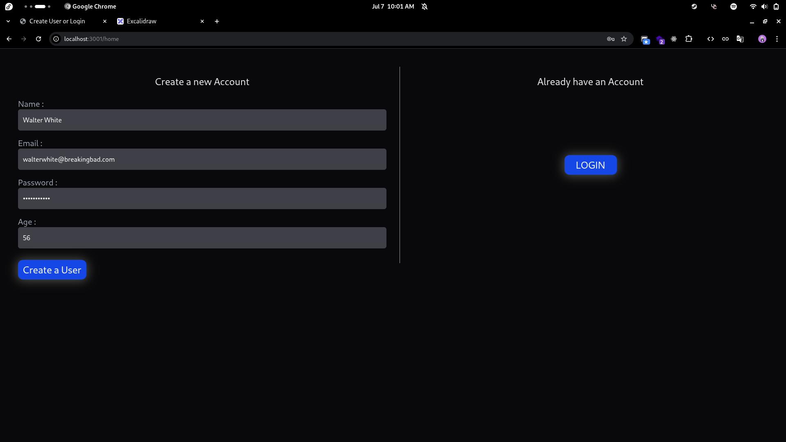
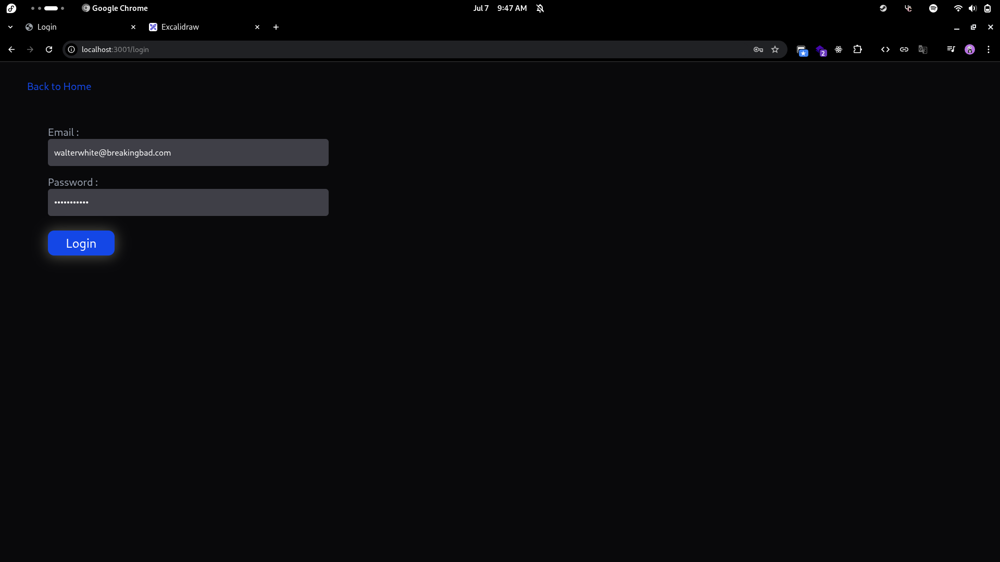
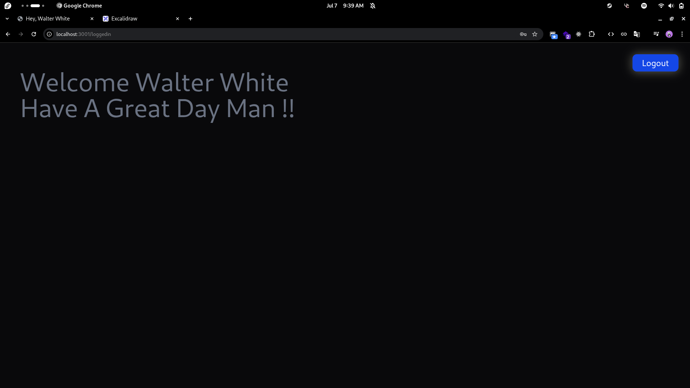

### Auth jwt , cookies and bcrypt

<a href="https://excalidraw.com/#json=-FS8xEezd4TmOfhgdws23,7WjciReRoU2ZrPE_8B3y5w">full diagram</a>
<br/>
<br/>

<a href="https://excalidraw.com/#json=-FS8xEezd4TmOfhgdws23,7WjciReRoU2ZrPE_8B3y5w"></a>

#### To set up and run the project locally.

```bash
git clone https://github.com/jaydhumal23/lAuth.git
cd lAuth
```

#### Install Dependencies

```bash
npm install
```

#### Create .env file and setup

```bash
mongourl="add db url"
PORT=3000
jwtpass="createjwtpass"
```

#### Run the App

```bash
npm run app
```

``
server running at localhost:3000
``

<br/>

<br/>

<br/>

